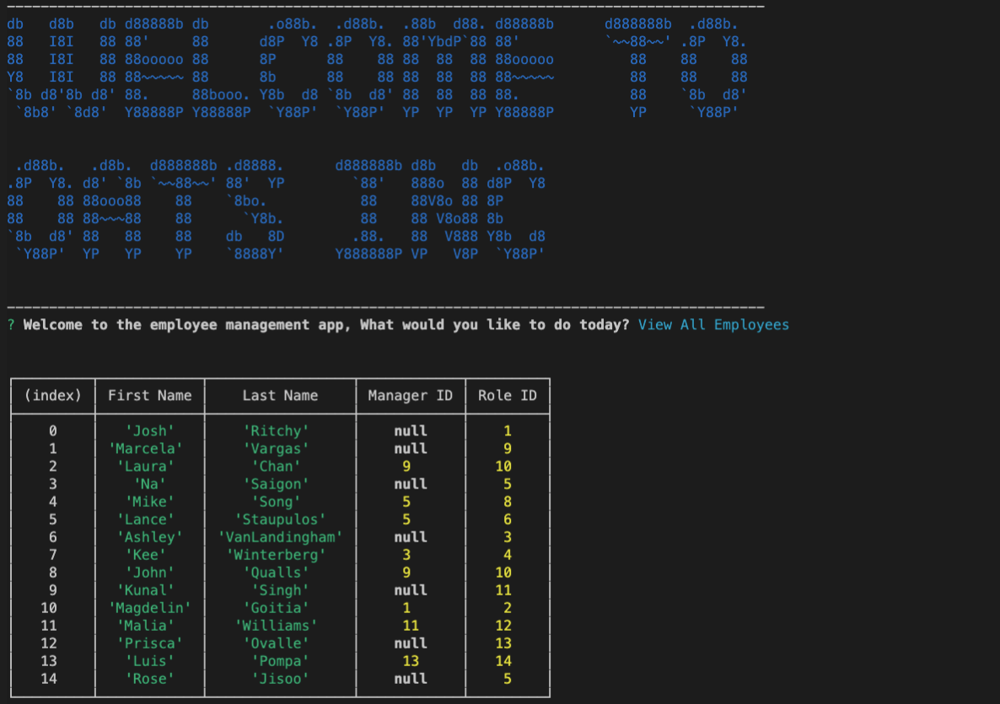
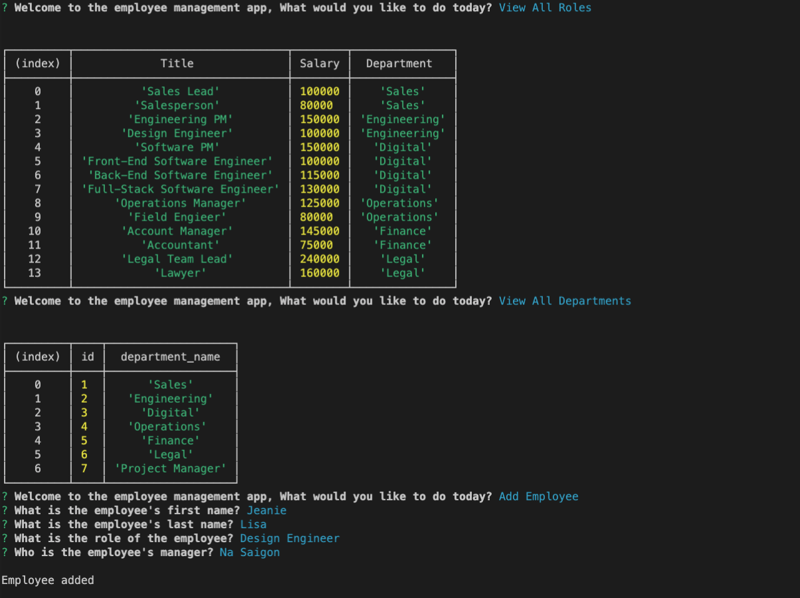

# 12 - MySQL: Employee Tracker

## Project

The project consists on creating a **C**ontent **M**anagement **S**ystems. The scope covers the architecture and build a solution for managing a company's employees using node, inquirer, and MySQL.


- [Installation](#Installation)
- [UserStory](#UserStory)
- [Screenshots](#Screenshots&Test)
- [Demo](#Demo)


## Installation  

1- Clone the repo  
2- Use the package manager "npm" to install all the node modules that are on the package.json.  

```bash
npm install
```


## User Story

```
As a business owner
I want to be able to view and manage the departments, roles, and employees in my company
So that I can organize and plan my business
```


## Screenshots 

The following images show the application appearance:








## Demo URL 


You can find the app deployed on the following link  
<a href="https://intense-brushlands-09129.herokuapp.com/" target="_blank">URL to App</a>


## Used Frameworks/Technologies

- Node.js
- Inquirer.js
- SQL
- JavaScript


### Contributor


Nicolas Cedano Avena
- - -
© 2021 Trilogy Education Services, LLC, a 2U, Inc. brand. Confidential and Proprietary. All Rights Reserved.